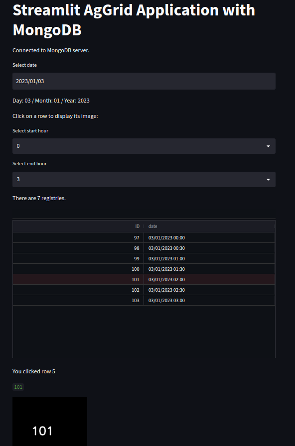

# Streamlit AgGrid Application with MongoDB

This repository contains a Streamlit application for browsing and visualizing images stored in a MongoDB database. The application can filter the images based on specific dates and hours, and displays them using AgGrid. It can easily be deployed in a Docker environment.

## Contents
- [Streamlit AgGrid Application with MongoDB](#streamlit-aggrid-application-with-mongodb)
  - [Contents](#contents)
  - [Installation](#installation)
  - [Usage](#usage)
  - [Data Generation](#data-generation)
    - [Environment Setup](#environment-setup)
  - [Docker Compose Configuration](#docker-compose-configuration)
  - [License](#license)

## Installation

Ensure Docker is installed on your machine. Clone the repository and navigate to the project directory.

```bash
git clone https://github.com/username/streamlit-aggrid-mongodb.git
cd streamlit-aggrid-mongodb
```

The application can be run using Docker Compose:

```bash
docker-compose up
```

The application will then be accessible at `http://localhost:8501`.

## Usage

The application offers an interactive user interface to browse and view images stored in a MongoDB database. Once the application is running at `http://localhost:8501`, you will find several interactive options:

1. **Date Selection**: Choose the date for which you want to view images.
2. **Start Hour and End Hour Selection**: You can select the start and end hours for the images you're interested in viewing.
3. **Image Grid**: Images corresponding to the selected date and time range will be displayed in a grid. You can click on a row to view the corresponding image.

Remember, the application connects to a MongoDB database and fetches images stored as base64 strings. The images are then decoded and displayed in the Streamlit application.



## Data Generation

To generate images and store them in the MongoDB database, you can use the `data-creation.py` script. This script generates images and stores them in the database along with the respective timestamps. 

```bash
python data-creation.py
```

Ensure MongoDB is running and accessible to the script for it to work correctly.

### Environment Setup

To set up the Python environment for running the `data-creation.py` script and other Python scripts, you can use the `requirements.txt` file in the `src` directory.

Create a new Python environment (e.g., with `conda` or `virtualenv`), then activate it and install the dependencies:

```bash
pip install -r src/requirements.txt
```

## Docker Compose Configuration

The provided `docker-compose.yml` file defines services for both the Streamlit application and the MongoDB database. It sets up and links these two services as follows:

1. **Streamlit-mongodb-dashboard**: This service is built from a Dockerfile in the project directory and starts the Streamlit application. The application is accessible at `http://localhost:8501`.

2. **MongoDB**: This service starts a MongoDB database using the `mongo:jammy` image. The database is accessible at `localhost:27017`. The database files are stored in the local directory `./mongo/data/db`.

To start these services, navigate to the project directory in the terminal and run `docker-compose up`. Both the Streamlit application and the MongoDB database will start, and they will be able to communicate with each other.


## License

This project is licensed under the terms of the MIT license.

